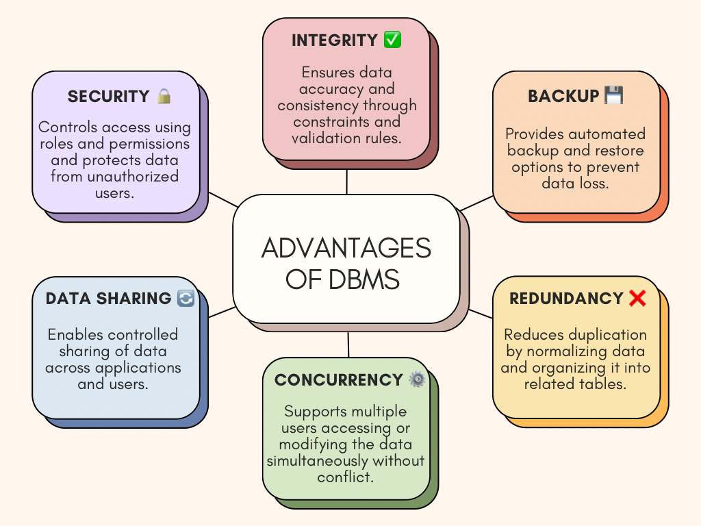

<h1 align="center">Database Search and Reporting</h1>

## 1. Flat File Systems vs. Relational Databases

| Feature           | Flat File System                                                                 | Relational Database                                                                 |
|-------------------|----------------------------------------------------------------------------------|-------------------------------------------------------------------------------------|
| **Structure**      | Stores data in plain text or CSV files with no enforced schema                 | Organizes data into tables with defined schemas and relationships                   |
| **Data Redundancy**| High redundancy due to repeated information across files                        | Low redundancy due to normalization and table relationships                         |
| **Relationships**  | No built-in support for relationships                                            | Supports one-to-many and many-to-many relationships via keys                        |
| **Example Usage**  | Contact lists, log files, CSV exports                                           | Banking systems, online stores, business management apps                            |
| **Drawbacks**      | Difficult to manage, high risk of inconsistency, poor scalability               | Requires setup and learning, can be complex for simple use cases                    |

## 2. DBMS Advantages – Mind Map

## 3. Roles in a Database System

In a database project, multiple roles work together to ensure the system is designed, developed, and maintained effectively. Below are the key roles and their responsibilities:

---

### 🔹 System Analyst
- **Role:** Acts as the bridge between business needs and technical solutions.
- **Responsibilities:**
  - Gather and analyze user requirements
  - Define system specifications
  - Ensure the database design aligns with business goals

---

### 🔹 Database Designer
- **Role:** Creates the blueprint for how data is structured and stored.
- **Responsibilities:**
  - Design the logical and physical structure of the database
  - Create entity-relationship (ER) diagrams
  - Ensure normalization and data integrity

---

### 🔹 Database Developer
- **Role:** Implements and builds the actual database based on the design.
- **Responsibilities:**
  - Write SQL queries, stored procedures, and triggers
  - Implement data models and indexes
  - Optimize performance and ensure proper data handling

---

### 🔹 Database Administrator (DBA)
- **Role:** Manages the ongoing operation and security of the database.
- **Responsibilities:**
  - Perform backups and restore operations
  - Monitor performance and tuning
  - Set up user access controls and security policies

---

### 🔹 Application Developer
- **Role:** Builds applications that interact with the database.
- **Responsibilities:**
  - Connect applications to the database using APIs or queries
  - Ensure front-end and back-end data consistency
  - Handle user interactions that require data input/output

---

### 🔹 BI (Business Intelligence) Developer
- **Role:** Transforms raw data into insights for decision-making.
- **Responsibilities:**
  - Develop dashboards and reports
  - Use data visualization tools (e.g., Power BI, Tableau)
  - Perform data extraction, transformation, and loading (ETL)

---

